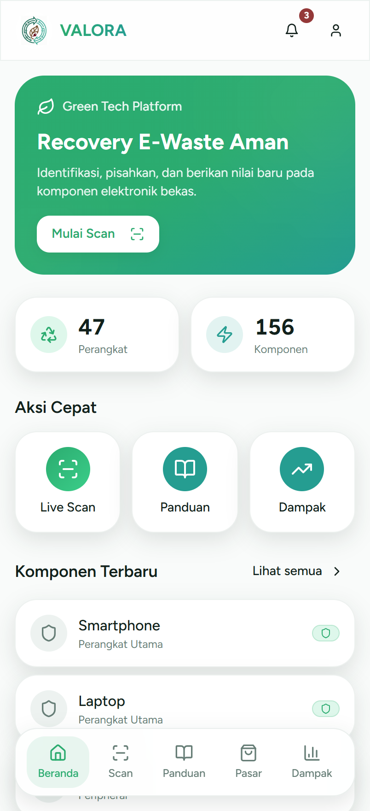

# Valora — Smart E-Waste Recovery

A mobile-first web app that helps people safely recover value from electronic waste. Point your camera at a device and an in-browser AI model recognises the electronics in view, then Valora guides you through separating components safely and giving them a second life.

**Live demo → [valora-ewaste.vercel.app](https://valora-ewaste.vercel.app)**



## Overview

Most electronics are thrown away with usable parts and hazardous materials still inside. Valora turns a phone into a recovery assistant: it identifies devices with on-device computer vision, explains which parts are valuable and which are dangerous, and points toward safe disassembly, reuse, and a component marketplace — all wrapped in a clean, animated mobile UI.

## Features

- **Live Scan** — real-time object detection running entirely in the browser via TensorFlow.js (COCO-SSD). Recognised electronics are mapped to recovery guidance, no server round-trip.
- **Safety first** — components are flagged by hazard level so users know what to handle with care.
- **Guide & Learn** — step-by-step recovery instructions and educational content.
- **Marketplace** — browse and list recovered components.
- **Impact Dashboard** — tracks devices recovered and components reused.
- **Onboarding + splash flow** and a polished, animated mobile interface.

## Tech stack

- React + Vite + TypeScript
- Tailwind CSS + shadcn/ui
- React Router
- Framer Motion for animation
- TensorFlow.js with the COCO-SSD model for in-browser object detection

## Run locally

```bash
git clone https://github.com/GianneAngely/valora-smart-e-waste-recovery.git
cd valora-smart-e-waste-recovery
npm install
npm run dev
```

Then open the printed local URL. Live Scan needs camera permission and is best viewed at a mobile viewport width.

## Note

Prototype built to explore the idea; impact numbers and marketplace listings use mock data. Object detection uses the general-purpose COCO-SSD model, so it recognises device-level electronics (phones, laptops, monitors, keyboards, and similar) rather than individual internal parts.
